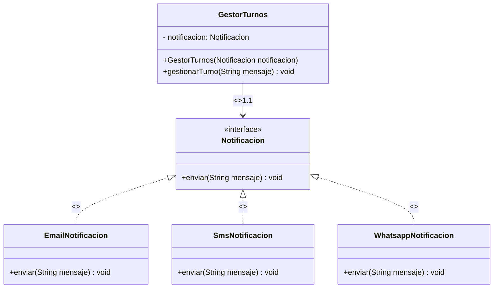

# Resolución de la Parte B: Aplicación de Principios SOLID

## Estructura y Relaciones de Clases

El rediseño se basa en el patrón **Strategy** para desacoplar la lógica de notificación del flujo de negocio principal.

### Clases Principales
1.  **`Notificacion`**: Interfaz abstracta. Define el contrato `void enviar(String mensaje)`. Es el punto de abstracción que inyectará la lógica de notificación.
2.  **`EmailNotificacion`**: Clase que implementa la interfaz `Notificacion`. Responsable exclusiva de enviar correos.
3.  **`SmsNotificacion`**: Clase que implementa la interfaz `Notificacion`. Responsable de enviar SMS.
4.  **`WhatsappNotificacion`**: Clase que implementa la interfaz `Notificacion`. Responsable de enviar mensajes a WhatsApp.
5.  **`GestorTurnos`**: Clase de alto nivel. Su única dependencia es la interfaz `Notificacion`. Dependiendo de esta abstracción, delega el envío al canal configurado, sin saber de antemano qué implementación concreta está utilizando.

### Relaciones Clave (UML Conceptual)

| # | Tipo de Relación | Elementos Involucrados | Dirección | Cardinalidad | Descripción Técnica |
|---|---|---|---|---|---|
| 1 | **Implementación** | `EmailNotificacion`, `SmsNotificacion`, `WhatsappNotificacion` → `Notificacion` | De las clases concretas hacia la interfaz | N:1 | Las tres clases concretas satisfacen el contrato definido por la interfaz `Notificacion`. Este es un **realization** (implementación), que refuerza el **Principio de Sustitución de Liskov (LSP)** y el **Principio Abierto/Cerrado (OCP)**: cualquier clase concreta es intercambiable sin modificar a `GestorTurnos`. |
| 2 | **Dependencia de Creación** | `GestorTurnos` → `Notificacion` | Desde la clase de alto nivel hacia la abstracción | 1:1 | La dependencia se materializa mediante **inyección de dependencias** vía constructor. `GestorTurnos` requiere una instancia de `Notificacion` para operar, pero **no crea** la instancia concreta (esta es proporcionada externamente en el momento de instanciamiento). Clasifíquese como **dependencia de creación** (`instantiate` semantics) y, al mismo tiempo, como **dependencia de uso** (`usage` semantics) durante la ejecución: el gestor invoca `Notificacion.enviar()` en tiempo de ejecución sin conocer la implementación concreta. Esto es la esencia del **Principio de Inversión de Dependencias (DIP)**: `GestorTurnos` depende de una abstracción, no de una implementación concreta. |
| 3 | **Asociación (por referencia)** | `GestorTurnos` — `Notificacion` | Unidireccional | 1:1 | La asociación se expresa como un atributo de tipo `Notificacion` dentro de `GestorTurnos`, inicializado exclusivamente a través del constructor (`GestorTurnos(Notificacion notificacion)`). La cardinalidad es **1:1** en este contexto: una instancia de `GestorTurnos` mantiene una referencia a una única instancia de `Notificacion`. No se trata de **composición** ni **agregación** en sentido estricto, ya que `GestorTurnos` no administra el ciclo de vida de la instancia de `Notificacion` (la instancia es externa y puede ser compartida o reemplazada sin destruir al gestor). |

> **Nota sobre terminología UML:** en la notación de clases, una inyección de dependencias se representa visualmente como una **asociación unidireccional** (línea con rombo sin relleno o simple flecha). La **dependencia** propiamente dicha (línea punteada con `<<use>>` o `<<create>>`) aparece cuando el consumidor referencia la abstracción solo en el contexto de un método (parámetro o valor de retorno). En este caso, dado que `Notificacion` se almacena como atributo de instancia, la representación más precisa es una **asociación unidireccional**, con una **dependencia de creación** sobre el proceso de instanciamiento.

### Diagramas de Clases (Conceptual)


**Leyenda de la notación Mermaid:**
- `|<..` — **Realization / Implementación**: la clase concreta implementa la interfaz.
- `-->` — **Association / Asociación unidireccional**: `GestorTurnos` mantiene una referencia a `Notificacion`. La etiqueta `<<inyecta>>` indica que la relación se resuelve mediante inyección de dependencias; la cardinalidad `1.1` indica que cada gestor posee exactamente una notificación.

# Código en Java

```java
// Estructura del Proyecto Refactorizado (Parte B: Aplicación SOLID)
// ------------------------------------------------------------------

// 1. Abstracción (Principio OCP / DIP)
interface Notificacion {
    /**
     * Método principal para enviar la notificación.
     * @param mensaje El contenido a enviar al paciente.
     */
    void enviar(String mensaje);
}

// 2. Implementaciones Concretas (Separación de Responsabilidades - SRP)

class EmailNotificacion implements Notificacion {
    @Override
    public void enviar(String mensaje) {
        // Lógica específica de Email
        System.out.println("Enviando EMAIL: " + mensaje);
    }
}

class SmsNotificacion implements Notificacion {
    @Override
    public void enviar(String mensaje) {
        // Lógica específica de SMS
        System.out.println("Enviando SMS: " + mensaje);
    }
}

class WhatsappNotificacion implements Notificacion {
    @Override
    public void enviar(String mensaje) {
        // Lógica específica de WhatsApp
        System.out.println("Enviando WhatsApp: " + mensaje);
    }
}

// 3. Clase de Alto Nivel (Gestor de Negocio - Dependencia en Abstracción)
// Esta clase ahora depende de la interfaz Notificacion (Abstracción)
// y no de clases concretas.
public class GestorTurnos {
    private Notificacion notificacion; // Dependencia por Abstracción

    // Inyección de dependencia (Constructor Injection)
    public GestorTurnos(Notificacion notificacion) {
        this.notificacion = notificacion;
    }

    public void gestionarTurno(String mensaje) {
        // El gestor delega la responsabilidad de 'cómo' notificar.
        // No sabe si es Email, SMS o WhatsApp.
        this.notificacion.enviar(mensaje);
        
        // ... lógica de negocio de gestión de turnos ...
    }
}

// 4. Uso del Sistema (Cliente)
public class Main {
    public static void main(String[] args) {
        // Ejemplo de uso con Email (Inversión de Control)
        Notificacion emailService = new EmailNotificacion();
        GestorTurnos gestor1 = new GestorTurnos(emailService);
        gestor1.gestionarTurno("Tu turno es mañana a las 10:00 AM.");

        // Ejemplo de uso con WhatsApp (Sin modificar GestorTurnos)
        Notificacion whatsappService = new WhatsappNotificacion();
        GestorTurnos gestor2 = new GestorTurnos(whatsappService);
        gestor2.gestionarTurno("Tu turno es mañana a las 10:00 AM.");
    }
}
```