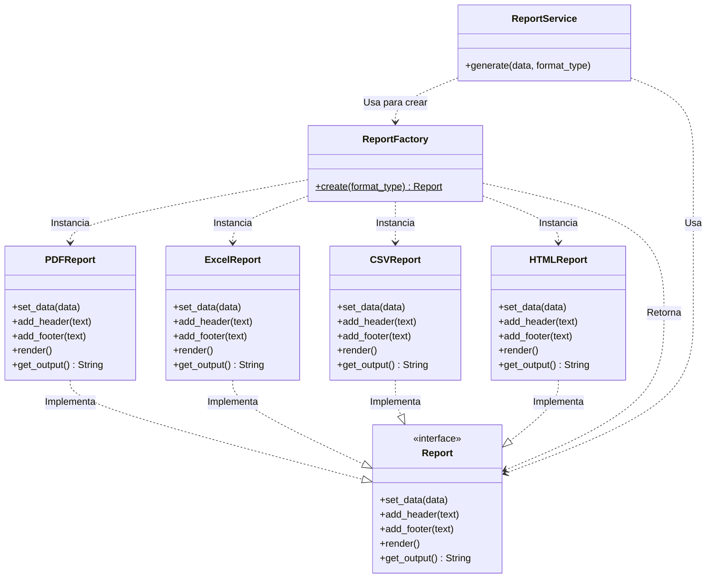

# Diagrama UML Final (Refactorizado con Static Factory)

El siguiente diagrama de clases ilustra la arquitectura del sistema después de aplicar el patrón Factory Method (en su variante Simple/Static Factory). 

A diferencia del diagrama inicial, `ReportService` ahora está completamente desacoplado de las implementaciones concretas (`PDFReport`, `HTMLReport`, etc.). Toda la lógica de instanciación fue delegada a `ReportFactory`, y el servicio interactúa exclusivamente a través de la abstracción `Report`.

