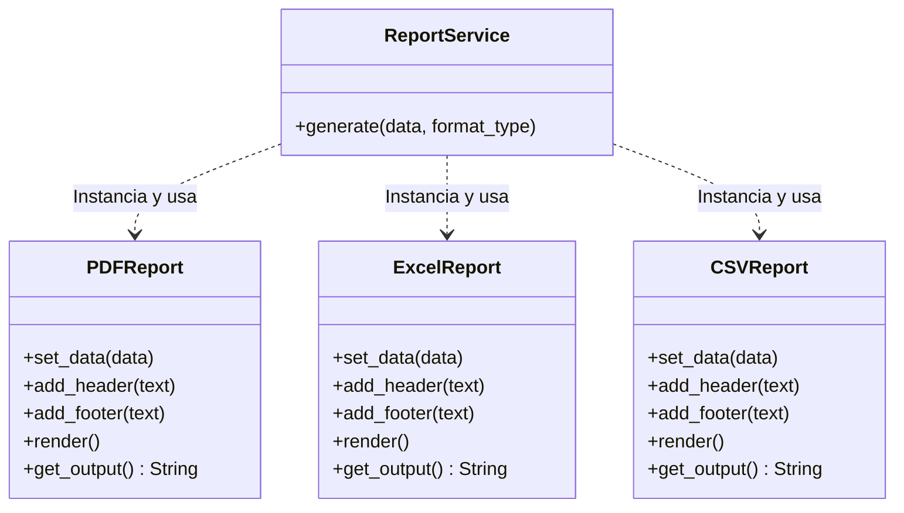

# Diagrama UML Inicial (Código Problemático)

El siguiente diagrama de clases muestra la situación del sistema antes de aplicar el patrón Factory Method. Como se observa, la clase `ReportService` está fuertemente acoplada a las implementaciones concretas de los reportes (`PDFReport`, `ExcelReport`, `CSVReport`), ya que las instancia directamente en su método `generate`.

