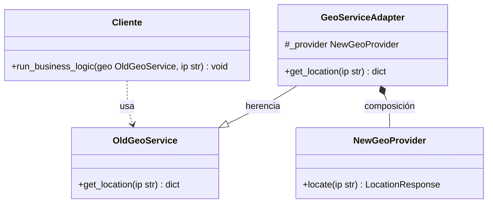

# Diagrama de Clases UML — Patrón Adapter (GoF)

Este diagrama modela la estructura de la solución implementada en Python.

---

## Explicación de las Relaciones

1. **Dependencia / Uso (`Cliente ..> OldGeoService`):**
   - El código de negocio del sistema (`Cliente` / `run_business_logic`) consume exclusivamente el protocolo definido por `OldGeoService` a través de su método `get_location(ip)`.
   - Representa un acoplamiento transitorio: el cliente recibe una referencia al servicio por parámetro para usarla, sin retenerla como atributo propio.

2. **Herencia / Generalización (`GeoServiceAdapter --|> OldGeoService`):**
   - `GeoServiceAdapter` hereda de `OldGeoService` para preservar el tipo común y la firma pública que el sistema espera.
   - De este modo, el adaptador se presenta ante el cliente como una instancia válida de `OldGeoService` (cumpliendo con el principio de sustitución de Liskov).

3. **Composición de Objetos (`GeoServiceAdapter *-- NewGeoProvider`):**
   - **El rol clave del atributo `#_provider`:** Este campo protegido es el anclaje estructural que materializa la relación en el código. Al retener la instancia del adaptee en su estado interno, deja de ser una dependencia transitoria (`..>`) y se convierte en una relación de posesión.
   - **Ciclo de vida (Composición vs. Agregación):** La instancia de `NewGeoProvider` se crea directamente dentro del constructor del adaptador (`self._provider = NewGeoProvider()`). Su ciclo de vida queda indisolublemente atado al del adaptador (nace con él), cumpliendo con la definición estricta de composición fuerte (rombo lleno `*--`) establecida en la guía de cátedra.

---

