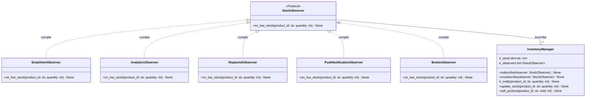

# UML — Solución refactorizada: Patrón Observer

El gestor de inventario (`InventoryManager`) se desacopla de las implementaciones concretas de notificación mediante una relación de agregación hacia la abstracción estructural `StockObserver`. Los suscriptores concretos implementan el protocolo mediante tipado estructural (*duck typing* estático), garantizando la extensibilidad y el aislamiento de responsabilidades.

---

## Justificación Detallada de las Relaciones entre Clases

Conforme a las convenciones de modelado UML en Python (`docs/guias/howto_uml.md`) que resumí de los materiales teóricos de Programación IV y las decisiones arquitectónicas del patrón Observer, cada relación en el diagrama responde a un motivo estructural y de ciclo de vida concreto.

### 1. Agregación: `InventoryManager` a `StockObserver` (`StockObserver "0..*" --o "1" InventoryManager`)

* **Por qué Agregación (`--o`, rombo vacío) y no Composición (`*--`) ni Asociación simple (`-->`):**
  * **Ciclo de vida independiente:** En la situación inicial acoplada, `InventoryManager` creaba los servicios dentro de su constructor (`self.email_service = EmailAlertService()`), configurando una composición donde las partes morían con el todo. En la solución refactorizada, el gestor **no instancia** los observadores: los recibe ya construidos desde el exterior a través del método `subscribe(observer)`. Si el gestor de inventario es destruido, los observadores continúan existiendo en el ámbito de la aplicación.
  * **Relación de posesión dinámica ("tiene un"):** `InventoryManager` mantiene una colección polimórfica `#_observers: list[StockObserver]`. Los elementos pueden suscribirse y desuscribirse dinámicamente en tiempo de ejecución mediante `unsubscribe()` sin alterar el estado del gestor.
  * **Multiplicidad (`1` a `0..*`):** Una instancia de `InventoryManager` puede operar con cero, uno o múltiples observadores registrados simultáneamente sin que el dominio de negocio se vea afectado.
  * **Inversión de dependencias:** El gestor depende exclusivamente de la abstracción `StockObserver` y desconoce por completo las clases concretas que lo suscriben.

---

### 2. Relación de Implementación: Observadores Concretos a `StockObserver` (`StockObserver <|.. Observador`)

* **Básicamente implementa protocolo:**
  Cada observador concreto satisface el contrato implementando el protocolo `StockObserver` (`typing.Protocol`). En Python esto significa que la clase no necesita heredar formalmente ni acoplarse: con solo definir el método `on_low_stock(self, product_id: str, quantity: int) -> None` con los parámetros y tipos requeridos, la clase ya conforma e implementa el protocolo (*duck typing* estático comprobable por type checkers).

---

### 3. Justificación Individual por Observador Concreto

Cada observador concreto satisface el protocolo `StockObserver` adaptando una responsabilidad específica del sistema:

1. **`EmailAlertObserver ..|> StockObserver` (Canal de Alertas por Correo):**
   * *Motivo:* Reemplaza el acoplamiento rígido hacia la clase `EmailAlertService` del código inicial. Envía advertencias por correo electrónico ante stock bajo mediante la interfaz estándar `on_low_stock`, eliminando llamadas a métodos con firmas ad-hoc (`send_low_stock_alert`).

2. **`AnalyticsObserver ..|> StockObserver` (Canal de Telemetría y Métricas):**
   * *Motivo:* Reemplaza el acoplamiento directo hacia `AnalyticsDashboard`. Registra eventos analíticos de inventario bajo respondiendo al mismo evento uniforme, abstrayendo la llamada propietaria `record_low_stock_event`.

3. **`ReplenishObserver ..|> StockObserver` (Canal de Reposición Logística):**
   * *Motivo:* Reemplaza el acoplamiento hacia `AutoReplenishment`. Emite solicitudes automáticas de reabastecimiento de stock de forma desacoplada, evitando que el gestor de inventario contenga lógica de compras o logística (`trigger_order`).

4. **`PushNotificationObserver ..|> StockObserver` (Demostración de Extensibilidad - Open/Closed):**
   * *Motivo:* Añade un nuevo canal de notificación móvil. Demuestra empíricamente el principio **Open/Closed**: el sistema pudo extenderse con un nuevo canal sin tener que tocar ni modificar una sola línea de código en `InventoryManager`.

5. **`BrokenObserver ..|> StockObserver` (Demostración de Resiliencia ante Fallos):**
   * *Motivo:* Implementa el protocolo para simular un fallo en tiempo de ejecución (lanza `RuntimeError("error de red simulado")`). Su relación en el diagrama justifica la presencia del bloque `try/except Exception` dentro del método `#_notify()` de `InventoryManager`, garantizando que la caída de un canal no impida la notificación al resto de los suscriptores.

