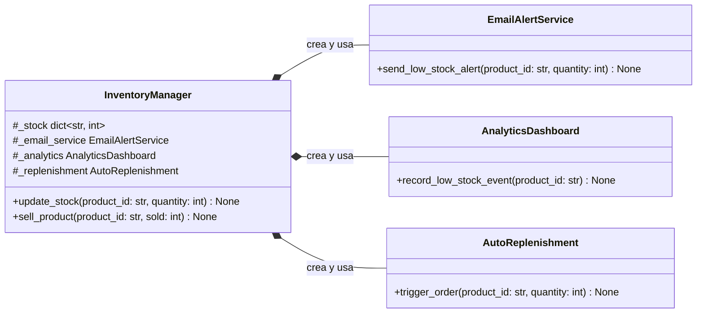

# UML — Situación inicial: `InventoryManager` acoplado

El gestor de inventario construye y conoce directamente los tres servicios de notificación. Como sus ciclos de vida nacen dentro del gestor, las relaciones son composiciones; añadir o cambiar un canal obliga a modificar `InventoryManager`.

